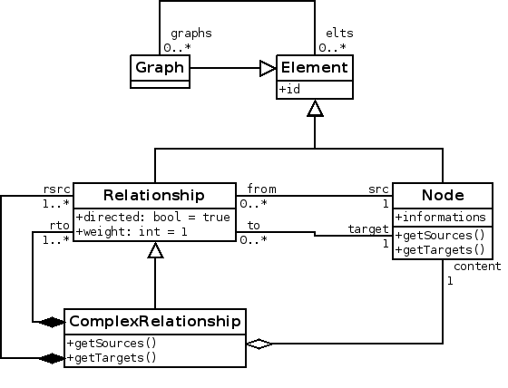
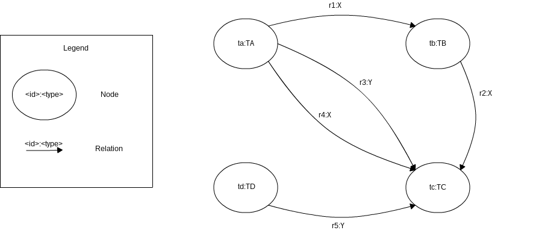

# graph

Graph modeled into **riak** and queried via *MapReduce* algorithms.

## Meta Model

## Riak Model

3 data types (with **Solr** schema):

 - [nodes](node.xml)
 - [relationships](relationship.xml)
 - [graphs](graph.xml)

## Initialize test environment

Run:

    $ ./clean.sh
    $ ./init.sh
    $ python fill.py

## Test queries

### Query 1

**File:** ``req1.py``

> Select all relations with type ``X``

### Query 2

**File:** ``req2.py`` (map-reduce algorithm: ``req2_mapreduce.py``)

> Select all nodes with 2 or more neighbors
> Follow relations 2 times
> Select nodes

### Query 3

**File:** ``req3.py`` (map-reduce algorithm: ``req3_mapreduce.py``)

> Select all nodes of type ``TB``
> Select all relations with those nodes as source, and the relations' targets
